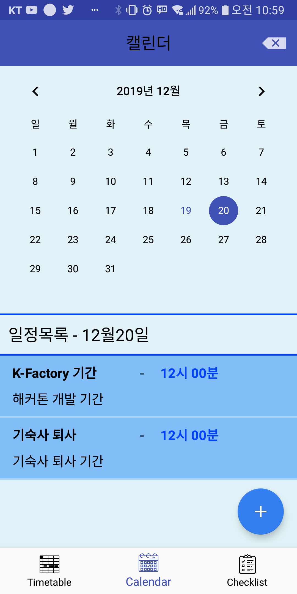

# My-Planner
2019-2 / Mobile Programming Team Project

시간표, 캘린더, 체크리스트 기능을 모두 포함한 간단한 일정관리 앱.

## 참여자
- 김민기: 시간표 기능 제작
- 김태휘: 체크리스트 기능 제작
- 박권규: 체크리스트 기능 제작
- 박준석: 캘린더 기능 제작

## 문의사항
이슈로 문의바랍니다.

## 실행화면
1. 스플래쉬

2. 시간표

3. 캘린더

4. 체크리스트

